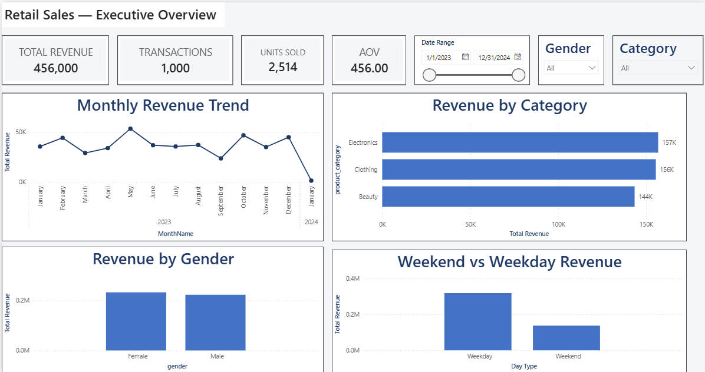
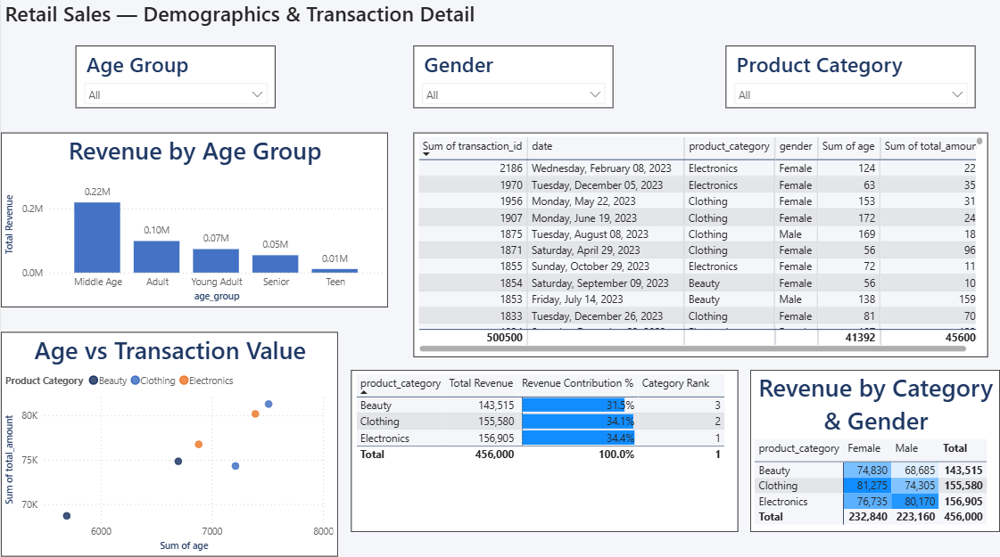

# 🛍️ Retail Sales Analysis Dashboard

An end-to-end Data Analytics project that analyzes retail sales data using Python, SQL, and Power BI. The project focuses on data cleaning, exploratory data analysis, business insights, SQL-based reporting, and an interactive Power BI dashboard.

---

## 📌 Project Overview

Retail businesses generate large volumes of transactional data every day. This project demonstrates how raw sales data can be transformed into meaningful business insights using the complete data analytics workflow.

The project includes:

- Data Cleaning with Python
- Exploratory Data Analysis (EDA)
- Business Insights
- SQL Business Analysis
- Interactive Power BI Dashboard

---

## 🎯 Objectives

- Analyze customer purchasing behavior
- Identify top-performing product categories
- Discover monthly sales trends
- Understand gender and age-wise purchasing patterns
- Identify valuable customers
- Build an interactive business dashboard

---

## 🛠️ Tech Stack

- Python
- Pandas
- NumPy
- Matplotlib
- Seaborn
- MySQL
- Power BI
- Git
- GitHub

---

## 📂 Project Workflow

### Phase 1 — Data Cleaning

- Removed duplicate records
- Checked missing values
- Converted date format
- Renamed columns
- Created new features:
  - Month
  - Month Name
  - Day Name
  - Quarter
  - Weekend Indicator
  - Age Group
  - Spending Category

---

### Phase 2 — Exploratory Data Analysis

Performed detailed analysis including:

- Sales Distribution
- Customer Age Distribution
- Gender Analysis
- Product Category Analysis
- Monthly Sales Trend
- Revenue by Category
- Quantity Sold
- Top Customers
- Correlation Analysis
- Weekend vs Weekday Sales

---

### Phase 3 — SQL Analysis

Business-focused SQL queries including:

- Total Revenue
- Average Order Value
- Revenue by Category
- Revenue by Gender
- Monthly Revenue
- Top Customers
- Customer Lifetime Value
- Ranking Functions
- Running Total
- Revenue Contribution
- Window Functions

---

### Phase 4 — Power BI Dashboard

Dashboard includes:

- KPI Cards
- Monthly Sales Trend
- Revenue by Category
- Quantity Sold
- Gender Analysis
- Age Group Analysis
- Weekend vs Weekday Sales
- Top Customers
- Interactive Filters

---

## 📈 Dashboard Preview

- Executive Overview


- Demographics & Transaction Detail


---

## 📊 Key Business Insights

- Product category performance varies significantly across the dataset.
- Monthly sales trends help identify peak demand periods.
- Customer purchasing behavior differs across age groups.
- High-value customers contribute a significant portion of total revenue.
- Sales patterns provide useful insights for inventory planning.
- Interactive dashboard enables quick business decision-making.

---

## 📁 Project Structure

```text
Retail-Sales-Analysis-Dashboard
│
├── Dataset
├── Python
├── SQL
├── PowerBI
├── Images
├── README.md
├── requirements.txt
```

---

## 🚀 Future Improvements

- Sales Forecasting
- Customer Segmentation
- RFM Analysis
- Profit Analysis
- Inventory Optimization
- Customer Lifetime Prediction

---

## 👨‍💻 Author

**Vansh Shah**

LinkedIn: *(Add your LinkedIn profile)*

GitHub: https://github.com/vansh303

---# Retail-Sales
